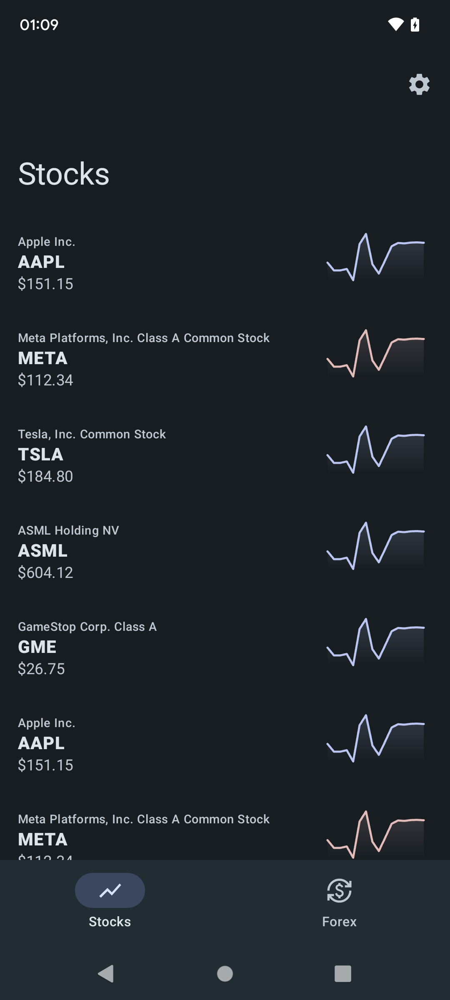

# Stocks

Android app for viewing stock market data.

## Description

This project has been built to learn Kotlin, Compose, and to build an android application to completion. It only supports android 13 and uses the experimental Material 3 Compose implementation.
